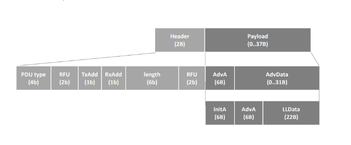

# libbleparser

## Overview

`libbleparser` is a library designed for parsing Bluetooth Low Energy (LE) advertising data. LE devices broadcast advertising data, which can be used for device discovery, connection establishment, and information dissemination. This library provides an API to interpret and parse this raw advertising data into a readable form, facilitating various actions based on the parsed information.

## Purpose

Bluetooth LE devices share advertising data in a specific format defined by the Bluetooth specification. This data can include information such as device name, manufacturer-specific data, class of device, and other relevant details. The `libbleparser` library helps decode these details using a repository of assigned numbers, enabling developers to easily interpret and use the advertising data.

## LE Advertising Report Structure

The core structure that represents the LE advertising report in this library is defined as follows:

```c
#define EVT_LE_ADVERTISING_REPORT 0x02
typedef struct {
    uint8_t     evt_type;      // Event type (e.g., ADV_IND)
    uint8_t     bdaddr_type;   // Address type (public or random)
    bdaddr_t    bdaddr;        // Device address
    uint8_t     length;        // Length of the data
    uint8_t     data[];        // Advertising data
} __attribute__ ((packed)) le_advertising_info;
```
## uint8_t data[] = 


 ### This is the format for the adv data[] with each array member being 8 bytes, determined by the ad_types.yaml. Under each AD type, there is more data inside the byte that can be extracted using bitwise operations. The advertising data is structured as a series of AD (Advertising Data) structures, each consisting of:

- **Length (1 byte)**: Total length of the AD structure.
- **AD Type (1 byte)**: Type of the advertising data (e.g., Complete Local Name, Manufacturer Specific Data).
- **AD Data (variable length)**: The actual data corresponding to the AD Type.

Each advertising data field provides specific information about the advertising device, such as its name, supported services, and manufacturer details. The data extraction


## Key Features

- **Parsing Manufacturer Specific Data**: Decode data from manufacturers embedded in the advertising packets.
- **Class of Device Interpretation**: Understand the class of device to determine the type and capabilities of the advertising device.
- **Modular Design**: Easily extendible to support additional types of advertising data as defined in the Bluetooth specification.

## How It Works

1. **Initialization**: Initialize the main structure with preloaded data.
2. **Parsing**: Pass the raw advertising data to the library to parse it and convert it into a readable form.
3. **Action**: Use the parsed data to perform various actions based on the information extracted.

## Installation

To use `libbleparser` in your project, include the header files and link against the static library provided by the project.

```bash
gcc -Wall -g -O2 -I./includes -o my_application my_application.c -L./build -lbleparser -lyaml
```

## Usage Example (coming soon)

## Functions

+ `init_ble_parser()`: Initializes all data structs and ble parser struct

+ `all the getters`: Available for the passed adv data

+ `destroy_ble_parser()`: Frees all associated data from the library

## Contributing
We welcome contributions to libbleparser. If you find a bug or have a feature request, please open an issue. If you would like to contribute code, please fork the repository and submit a pull request.

